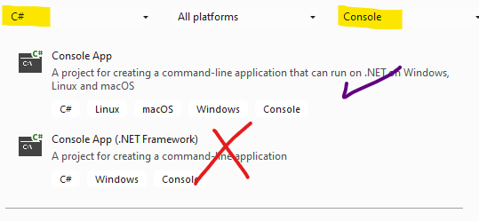

# First Lab
## Overview
In this lab, we will create a console application and a simple class and test code 

| | |
| --------- | --------------------------- |
| Exercise Folder | FirstLab |
| Builds On | None |
| Time to complete | 20 minutes

---
In this lab, we will create a console
application and a simple class and test code
---
1. Open Visual Studio Community 2022 and choose *Create new Project*
1. In the filters, choose *C#* and *Console* 
1. Choose a *Console* application (note - there are 2 project types. .Net Core has multiple platforms while .Net framework is Windows only.  Choose .Net Core projects)
1. Name your project *FirstLab*
1. Change the name of the solution to *Labs*
1. Change the location of the project to whatever folder works best
1. Right-click on the new project in the *Solution Explorer* and choose *Add/Class*
1. Name the class **Employee**
---
## Class Design
 
- Change the class to public
- Remove the unneeded *usings*
- Create fields
    - firstName
    - lastName
    - salary
    - TAX_RATE  (const)
- Create Properties
    - FirstName
    - LastName
    - Salary
    - YtdGrossPay (auto property, private set)
    - HireDate (auto property, **init** instead of **set**)
- Pay Method - calculate taxes, return net.  Increase YtdGrossPay
- Constructor - accept name, salary, and hiredate arguments
---
## Main
In *Program.cs* in top-level code, create a sample Employee.
Set/Get properties
Pay the employee

