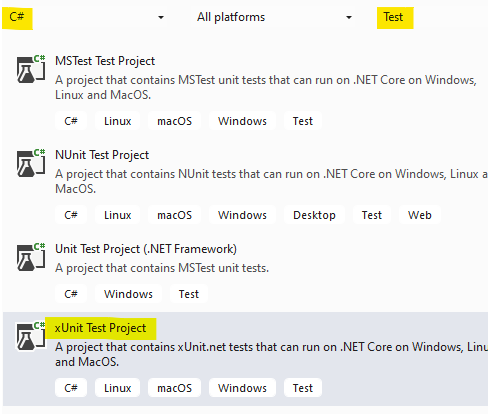

# xUnit Intro
## Overview
In this lab, we get started with xUnit.  
Using TDD process, we will define some new capabilities in the *Employee* class.
## Steps
- Create a new xUnit project in your solution 
- Copy *Employee.cs* from the last project into this project
- Rename the initial file (UnitTest1.cs) to *EmployeeTest.cs* and change the 
class name to *EmployeeTest*

We want to define a new property in the Employee class
- Tenure - a read-only int property that calculates the number of years the employee
has been employed

Update the Pay() method as follows:
- If the employee's tenure is >= 5 years, their pay is increased by 2% from their 
base salary
- Create the test first!  For this scenario, a **Theory** is probably the best choice.
 
```cs
[Theory]
[InlineData(6, 100.0, 94.2)]
[InlineData(0, 100.0, 92.35)]
[InlineData(3, 200.0, 184.7)]
public void TestPay(int tenure, double sal, double pay)
{
```

