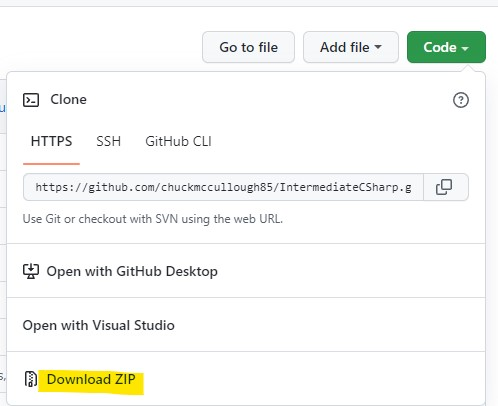

# Intermediate C#

Welcome to Intermediate C# with applications.
This repository contains all the lab instructions, code, and solutions for you to use during the course.

To download a local copy, click on the **Code** button at the
top right of this screen and in the pulldown, click **Download ZIP**

Of course, you can also use git or Visual Studio to pull the repository.

If your organization is blocking access, notify the instructor.

All labs, lab instructions and starter files are in the [Labs](Labs) folder.

All solutions are in the [Solutions](Solutions) folder.  Please at least try to do the lab before resorting to the solution.

